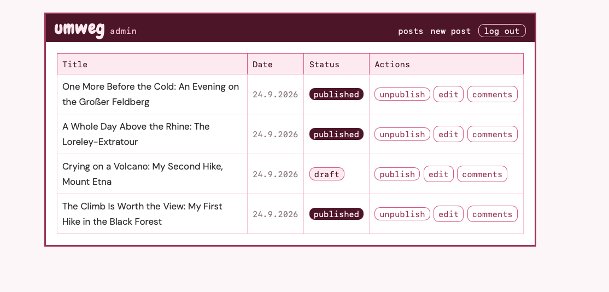
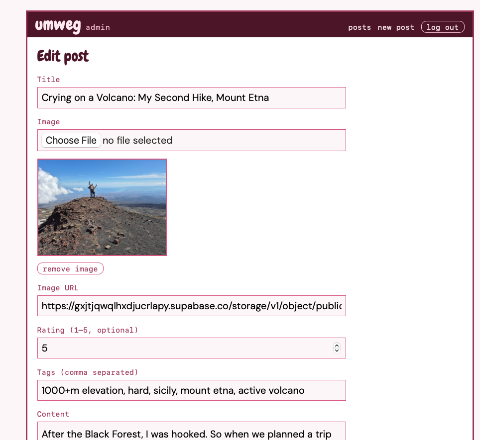
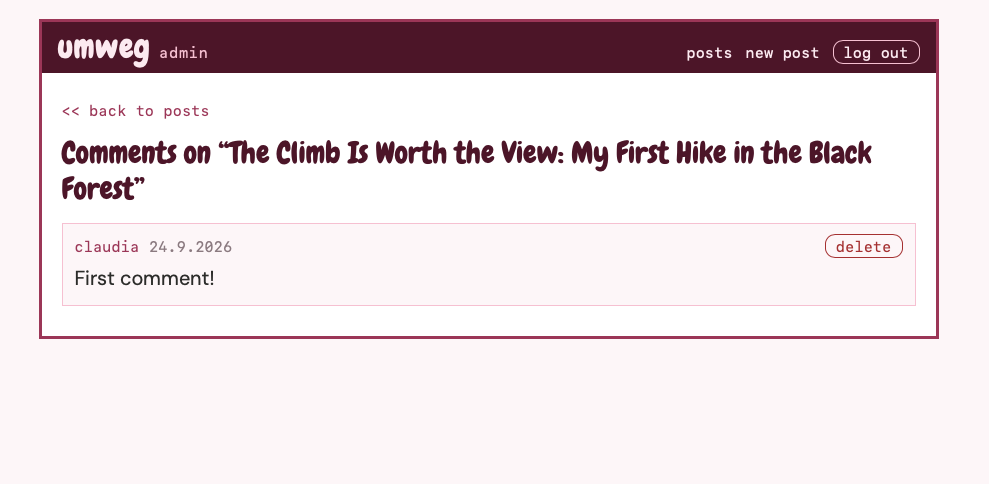

# Umweg

A travel blog built as an API-only backend with two separate frontends — one for reading, one for writing.
Hosted on free tiers, so the first request may take a minute while the server and database wake up.

## Why three apps

The point of this project is separating the backend from whatever consumes it. One Express API serves JSON to two React apps that share no code: a public reader where anyone can browse posts and comment, and a private author dashboard where posts are written, published and moderated. Neither frontend knows anything about the database; both talk to the same endpoints.

## The author dashboard

The admin side isn't publicly linked — it's behind a login and only users with `isAuthor` can reach it. Screenshots instead:

Every post, published or draft, with one-click publishing.

Images upload straight to Supabase Storage and the returned URL fills the field.

Comments on a single post, with delete.

## Structure

| Folder | What it is | Runs on |
|---|---|---|
| `api/` | Express + Prisma JSON API | 8080 |
| `reader/` | Public blog, React + Vite | 5173 |
| `author/` | Admin dashboard, React + Vite | 5174 |

Each has its own `package.json` and its own dependencies. Commands run from inside the relevant folder.

## Stack

Express 5, Prisma ORM 7, PostgreSQL, JWT auth via Passport, Supabase Storage for post images, React with React Router, Vitest and Testing Library for the frontends.

## Auth

Authentication is stateless. Logging in returns a signed JWT that the client stores in `localStorage` and sends as an `Authorization: Bearer` header on every subsequent request. The API verifies the signature, looks the user up, and attaches them to the request — there are no sessions and nothing is stored server-side.

Two guards protect routes: `requireAuth` for anything needing a logged-in user, and `requireAuthor` on top of it for anything that writes posts. Authors are promoted by hand in the database; there is no route that grants it, so there is nothing to attack.

Tokens expire after an hour. The API client clears a dead token and redirects to login when it sees a 401.

## Tests

`npm run test` in either frontend. Components that fetch are tested with the API module mocked, so nothing hits a live server.

## Notes

Ownership is enforced in the query rather than checked afterwards — a comment that isn't yours and one that doesn't exist both come back as nothing, so there's no way to probe for what exists.

Post responses name their fields explicitly with `select` rather than returning whole rows. Without that, including a post's author would ship the password hash to the browser.

The author id on a new post comes from the verified token, never from the request body. Anything in the body is a claim; only the token has been proven.